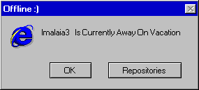

 
 <h2 align="center">Hmm</h2>
 
Hey I'm Imalaia3!

<a href="https://www.producthunt.com/posts/awesome-github-profiles?utm_source=badge-featured&utm_medium=badge&utm_souce=badge-awesome-github-profiles">
<!-- reverse Engineer, Lib Developer, App Developer, OSDev-->

<!---->

- 🖥️ I’m currently working on OS & Mailing Client
- 🌱 I’m currently learning C++, PHP, CSS, HTML
- 🧑‍💼 I’m looking to collaborate with anyone!
<!--- 💬 Ask me about ..-->
<!--- ⚡ Fun fact: ..-->
- ☎️ Contacts: [Discord](https://discord.com/users/661629086665408531)

     

